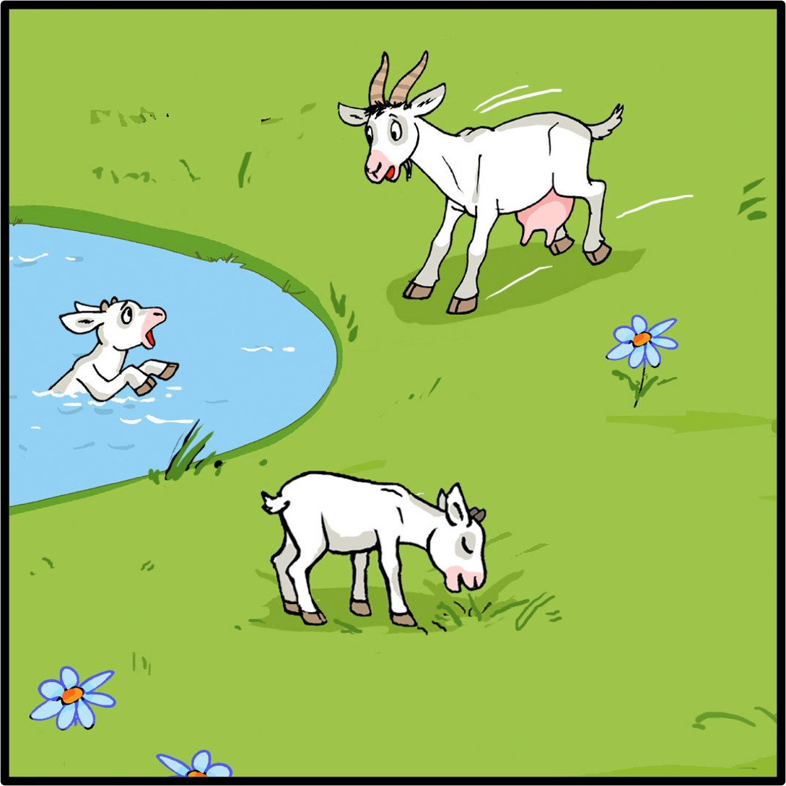
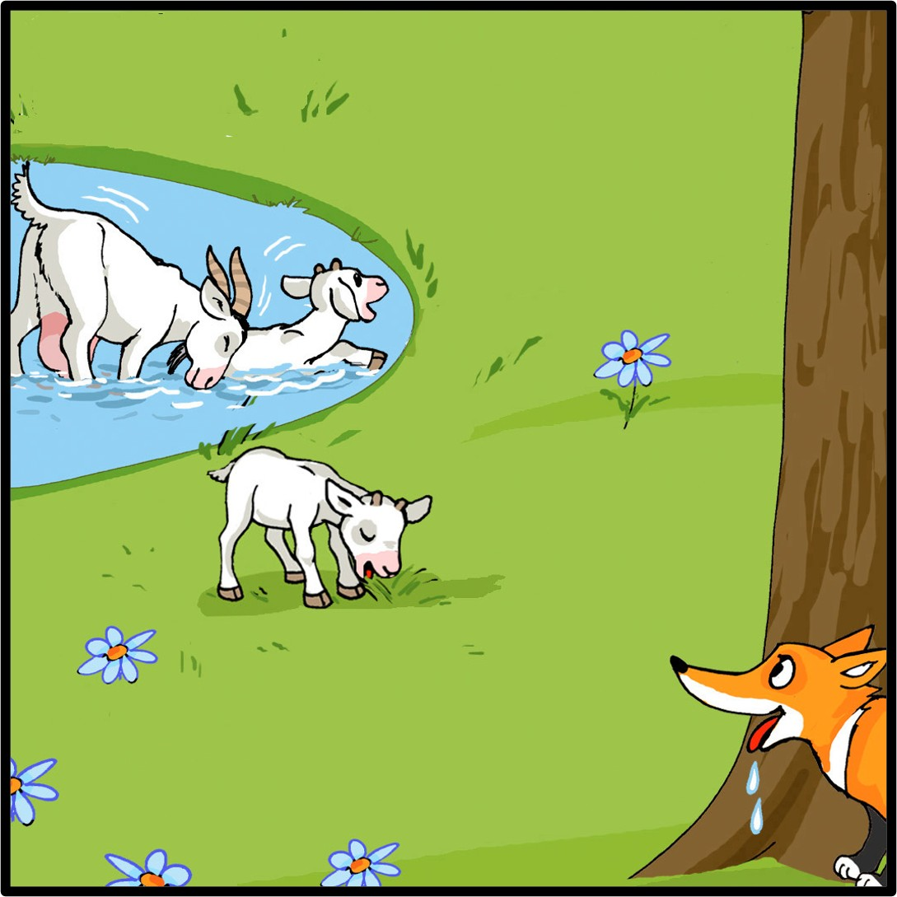
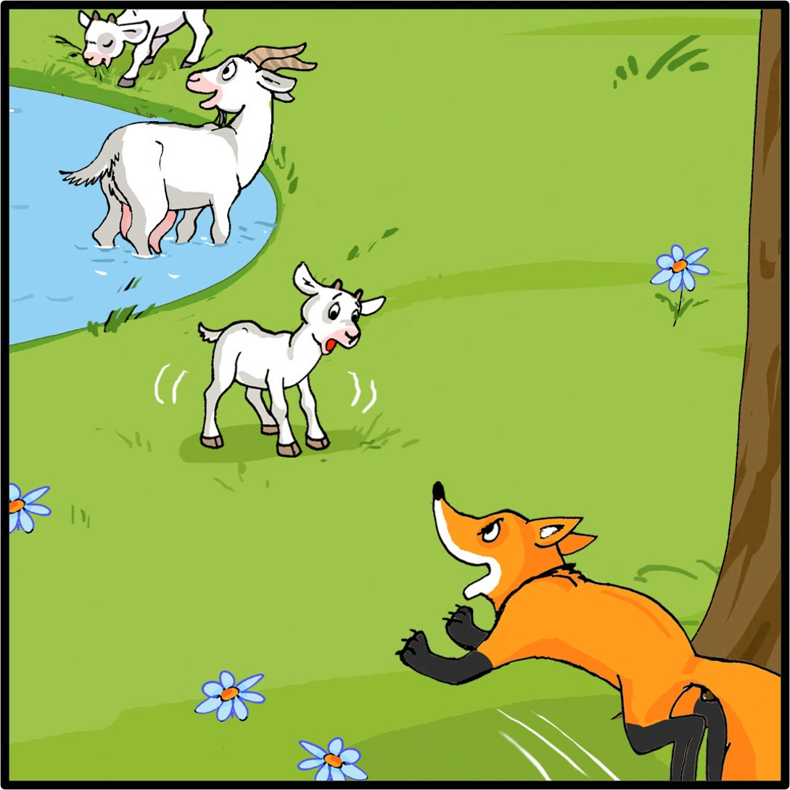
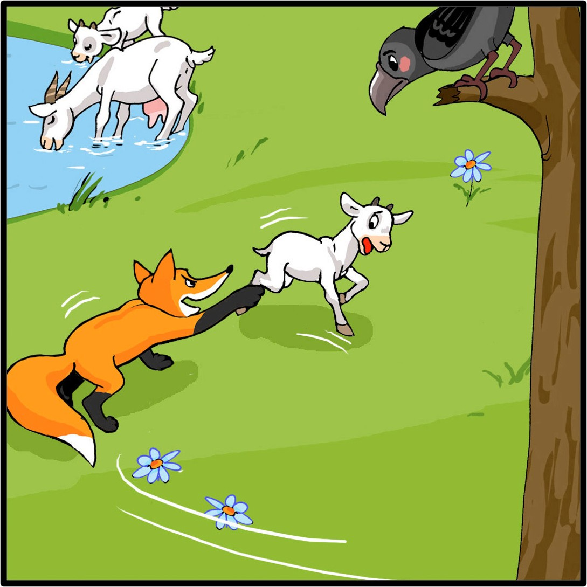
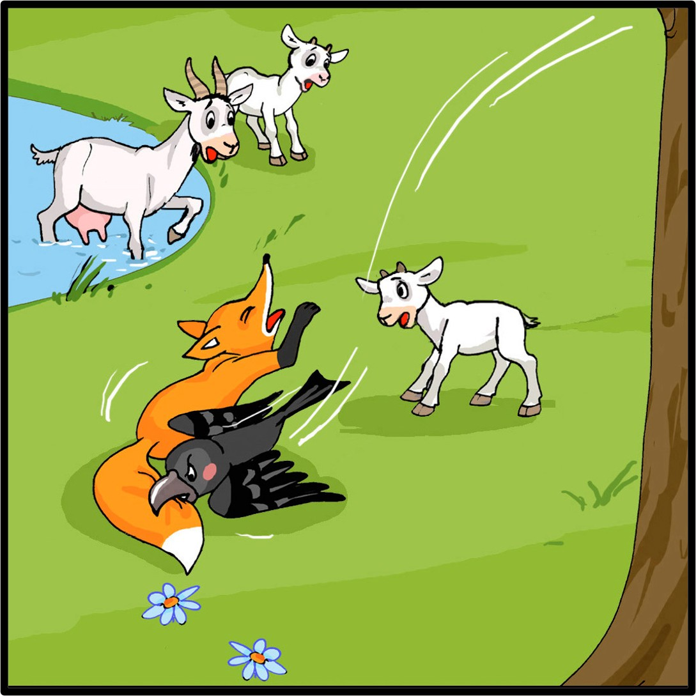
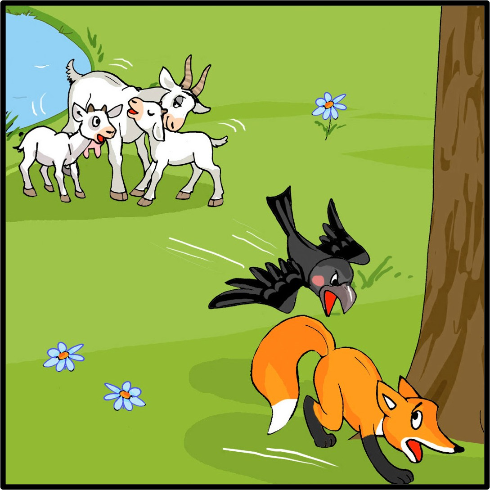

# IS Website

### Design and Development of a Digital Interface for Remote Multilingual Child Language Narrative Assessment and Storytelling

A research grade web platform that elicits, records, and stores spoken narratives from children aged **5–12 years** using picture-based story prompts. The platform is built to support remote, parent- or teacher-administered child language assessment in multilingual and low-resource settings, while preserving the procedural consistency that traditional clinic- or lab-based protocols depend on.

---

## 1. Purpose

Narrative assessment is one of the most informative methods for evaluating a child's language abilities. Free-form storytelling reveals vocabulary, syntactic complexity, discourse organisation, macrostructure (setting → initiating event → goal → attempt → outcome), and cognitive-linguistic competence — all in a single ecologically valid task. Yet in practice, narrative assessment is constrained by:

- The need for trained clinicians, speech-language pathologists, or researchers as administrators.
- Limited access to professionals in remote, rural, or low-resource regions.
- The absence of standardised digital tooling for multilingual narrative elicitation.
- Inconsistent administration procedures when assessments are run by different people in different places.
- Inability to scale to the sample sizes modern cross-linguistic and developmental studies require.

This project delivers a deployable, child-friendly digital interface that addresses these gaps. A child opens the application, selects a story made of sequential pictures, and narrates the story aloud while the browser captures the audio. A grown-up administrator (parent, teacher, or researcher) follows on-screen elicitation prompts derived from established narrative-assessment protocols. The resulting recordings, together with structured metadata, are stored in a cloud database for later linguistic and clinical analysis.

The work is methodologically grounded in:

- The **Multilingual Assessment Instrument for Narratives (MAIN)** (Gagarina et al., 2019), which formalises picture-prompted narrative elicitation across languages.
- COVID-19-era remote child language assessment studies, which demonstrated that parent-administered, naturalistic narrative data collection is feasible and yields ecologically valid samples.
- Minimum narrative token-count thresholds reported in the child speech literature (Wren et al., 2020), which inform target recording lengths.

## 2. Scope of work

The implementation in this repository covers the end-to-end stack required to run such a study:

1. **Child interaction module** — a touch-friendly, visually-led React front end that walks a child through name entry, story selection, sequential picture presentation, and recording.
2. **Narrative elicitation workflow** — a one-time on-screen instruction set for the administrator (sit opposite the child, prompt with neutral cues, ask the comprehension questions at the end) that standardises how a session is run, regardless of who runs it.
3. **In-browser audio capture** — a `MediaRecorder`-based recorder with start / stop / preview / re-record / submit, format negotiation across browsers (Opus/WebM, AAC/MP4), and live duration display.
4. **Backend service** — a Node.js / Express API that persists narrative metadata and streams audio binaries into MongoDB **GridFS**, so a single database holds both the structured and binary research artefacts.
5. **Administrator module** — a JWT-authenticated dashboard for the research/teaching team to browse recordings, play them back inline, and curate the corpus.
6. **Offline-resilient design** — if the API is unreachable, the front end gracefully falls back to a built-in example story so a pilot session is never blocked by a network or database outage.

## 3. Why this is research-grade

The platform is not a generic storytelling toy. Several design choices are made explicitly to make the data it collects useful for research:

- **Standardised stimulus presentation.** Every child sees the same images, in the same order, at the same resolution, with no autoplay or animation, removing a major source of administrator-induced variance.
- **Structured elicitation prompts.** The instructions modal codifies neutral verbal scaffolds ("then?", "tell me the rest", "let's see what happens next") drawn from narrative-assessment best practice, so the prompt set is constant across administrators.
- **Faithful audio capture.** Recordings are uploaded as the browser-native encoded blob (Opus/WebM on Chromium/Firefox, AAC/MP4 on Safari/iOS) without lossy resampling, preserving signal quality for downstream acoustic and linguistic analysis.
- **Linked metadata.** Each recording is stored with `childName`, `storyId`, `storyName`, `duration`, and `date`, and is keyed against the canonical story document in the database, so corpus queries (per child, per story, longitudinal) are straightforward.
- **Reproducible deployment.** The whole stack (React + Vite + Express + MongoDB + GridFS) runs locally with two terminals and an `.env` file, and can be redeployed to a fresh environment without bespoke infrastructure — important when a study moves between sites or when data has to live in a specific jurisdiction.
- **Ethics-aware defaults.** Children's voice data is treated as personal data: admin authentication is required to access the corpus, CORS is locked down in production, and the documentation explicitly flags the consent, data-minimisation, and rotation steps that a study lead must complete before live use.

## 4. Target population and languages

- **Primary participants:** children aged 5–12 years.
- **Secondary participants (administrators):** parents, teachers, and researchers.
- **Languages targeted by the broader research programme:** English, Hindi, Telugu, Malayalam, with the architecture left intentionally language-agnostic so additional languages can be added as new story sets without code changes.

## 5. Example narrative stimulus — *BB Story*

The repository ships with one fully wired example narrative — *BB Story*, a six-panel picture sequence about a small goat in a tricky spot, used here to demonstrate the end-to-end flow. Stimuli used in actual studies should be selected or licensed in consultation with the research team and (where appropriate) under MAIN-aligned guidance.

| Panel 1 | Panel 2 | Panel 3 |
| :---: | :---: | :---: |
|  |  |  |
| **Panel 4** | **Panel 5** | **Panel 6** |
|  |  |  |

---

## Table of contents

- [Features](#features)
- [Architecture](#architecture)
- [Project layout](#project-layout)
- [Prerequisites](#prerequisites)
- [Quick start](#quick-start)
- [Environment variables](#environment-variables)
- [Running locally](#running-locally)
- [Seeding the database](#seeding-the-database)
- [User flow](#user-flow)
- [Admin flow](#admin-flow)
- [Story data model](#story-data-model)
- [API reference](#api-reference)
- [Offline / local fallback](#offline--local-fallback)
- [Audio storage (GridFS)](#audio-storage-gridfs)
- [Building for production](#building-for-production)
- [Deployment notes](#deployment-notes)
- [Troubleshooting](#troubleshooting)
- [Security notes](#security-notes)
- [License](#license)

---

## Features

- **Picture-paged stories**: Each story is a sequence of images. The narration page shows one panel at a time with a thumbnail strip, prev/next navigation, full-screen zoom, and a clear page counter.
- **In-browser audio recording**: Uses the `MediaRecorder` Web API. Records `audio/webm` (Opus) where supported, falls back to `audio/mp4` on Safari/iOS.
- **Upload to backend**: Recordings are streamed to the backend and stored in MongoDB **GridFS** so audio binaries live alongside metadata.
- **Local fallback**: If the API or MongoDB is unreachable, the app falls back to a built-in `BB Story` so a child can still narrate. (No recording upload in this case.)
- **Admin dashboard**: Username/password login (JWT in `localStorage`). View all recordings, play them back from a streaming endpoint, and delete the ones you no longer need.
- **Modern UI**: Tailwind v4, gradient/blur aesthetic, `lucide-react` icons, mobile-first with safe-area support.

---

## Architecture

```
┌─────────────────────────┐         HTTP (Vite proxy /api → :5000)         ┌─────────────────────────┐
│   Frontend (Vite)       │ ─────────────────────────────────────────────► │   Backend (Express)     │
│   React 19 + Tailwind 4 │                                                │   Node.js + Mongoose    │
│   react-router-dom 7    │                                                │   JWT + Multer + GridFS │
└─────────────┬───────────┘                                                └─────────────┬───────────┘
              │                                                                          │
              │  MediaRecorder → Blob → multipart/form-data                              │
              ▼                                                                          ▼
         Browser mic                                                              MongoDB (storytime)
                                                                                   - admins
                                                                                   - stories
                                                                                   - recordings (metadata)
                                                                                   - recordings.files / .chunks (GridFS)
```

**Tech stack:**

| Layer    | Tools                                                                          |
| -------- | ------------------------------------------------------------------------------ |
| Frontend | React 19, Vite 7, Tailwind CSS v4, react-router-dom 7, axios, lucide-react      |
| Backend  | Node.js, Express 5, Mongoose 9, JWT (`jsonwebtoken`), Multer, bcryptjs, dotenv |
| Database | MongoDB (with GridFS for audio blobs)                                          |

---

## Project layout

```
IS_Website/
├── BB_story/                  # Source story panels (1.jpg … 6.jpg) used by the bundled local story
├── backend/                   # Express API
│   ├── models/                # Mongoose schemas: Admin, Story, Recording
│   ├── routes/                # Express routers: admin, stories, recordings
│   ├── env.example            # Copy to .env
│   ├── seed.js                # Seeds default admin + BB Story
│   └── server.js              # App entrypoint
├── frontend/                  # Vite + React app
│   ├── src/
│   │   ├── pages/             # Home, StorySelection, Narration, AdminLogin, AdminDashboard
│   │   ├── components/        # AudioRecorder
│   │   ├── data/localStories.js   # Offline fallback story (imports BB_story/*.jpg)
│   │   └── utils/             # api.js (axios), storyLoader.js (api + fallback merge)
│   ├── vite.config.js         # /api → http://127.0.0.1:5000 proxy
│   └── vercel.json
├── docs/                      # Research notes and proposal prompts
├── scripts/
│   ├── install.sh             # Installs deps for both apps
│   └── run-local.sh           # Boots both servers
└── README.md
```

---

## Prerequisites

- **Node.js** 18+ and **npm** (Node 20 LTS recommended)
- **MongoDB** 6+ running locally on `mongodb://127.0.0.1:27017`
  - macOS: `brew install mongodb-community && brew services start mongodb-community`
  - Or use a free MongoDB Atlas cluster and put its connection string in `MONGO_URI`
- A modern browser with microphone support (Chrome, Edge, Firefox, Safari)

---

## Quick start

```bash
# 1. Clone & install
git clone <repo-url> IS_Website
cd IS_Website
bash scripts/install.sh

# 2. Backend env
cp backend/env.example backend/.env
# edit backend/.env — set MONGO_URI and JWT_SECRET

# 3. (Optional) seed the default admin + BB Story
cd backend && npm run seed && cd ..

# 4. Run both servers
bash scripts/run-local.sh
```

Then open:

- App: <http://localhost:5173>
- Admin: <http://localhost:5173/admin>
- API: <http://localhost:5000/api/...>

---

## Environment variables

Copy `backend/env.example` to `backend/.env`:

```bash
cp backend/env.example backend/.env
```

Then edit:

| Variable      | Required | Default                                          | Description                                                                                          |
| ------------- | -------- | ------------------------------------------------ | ---------------------------------------------------------------------------------------------------- |
| `MONGO_URI`   | yes      | `mongodb://127.0.0.1:27017/storytime`            | MongoDB connection string. Use an Atlas URI in production.                                           |
| `JWT_SECRET`  | yes      | (none — set me)                                  | Long random string used to sign admin JWTs. Rotate if it ever leaks.                                 |
| `FRONTEND_URL`| no       | `http://localhost:5173`                          | Comma-separated extra allowed CORS origins. Required when `NODE_ENV=production`.                     |
| `PORT`        | no       | `5000`                                           | Port the Express server listens on.                                                                  |
| `NODE_ENV`    | no       | undefined                                        | Set to `production` to enforce strict CORS (only `FRONTEND_URL` + localhost defaults are accepted).  |

Optional **frontend** override (only needed if your API is on a different origin in production):

| Variable        | Where      | Default                                                  | Description                              |
| --------------- | ---------- | -------------------------------------------------------- | ---------------------------------------- |
| `VITE_API_URL`  | build-time | `/api` in dev (proxied); `http://localhost:5000/api` else | Base URL the frontend uses for API calls. |

In dev, Vite proxies `/api/*` to `http://127.0.0.1:5000`, so you typically don't need to set `VITE_API_URL` at all.

---

## Running locally

### Option A — One command

```bash
bash scripts/run-local.sh
```

Boots the backend on `:5000` and Vite on `:5173` in the same terminal. Ctrl+C kills both.

### Option B — Two terminals

```bash
# Terminal 1
cd backend && npm start

# Terminal 2
cd frontend && npm run dev
```

`backend/npm start` runs `node server.js`. There is no nodemon dependency declared in `backend/package.json`, so restart manually after backend code changes (or add nodemon yourself if you prefer).

---

## Seeding the database

```bash
cd backend
npm run seed
```

This script (`backend/seed.js`):

1. Creates an admin user if it doesn't already exist:
   - username: `Santhuthota`
   - password: `Iamafool@123`
2. Creates a `BB Story` document with the six panel paths (`/assets/BB_story/1.jpg` … `/6.jpg`) if it doesn't already exist.

**Change the seeded admin password before any non-local use.** Either edit `backend/seed.js` before running it, or update the password through the admin model and re-seed.

> Even if you skip seeding, the app stays usable: the frontend falls back to a built-in `BB Story` (imported from `BB_story/1.jpg`–`6.jpg`) so picture narration works without any DB.

---

## User flow

1. **Home (`/`)** — Child enters a name (stored in `localStorage`) or continues as a guest, then proceeds to the story library.
2. **Story selection (`/stories`)** — Cards show story covers (the first image of each story). Click one to open it.
3. **Narration (`/narration/:id`)** — A one-time instructions modal appears explaining how grown-ups should prompt the child. After dismissing it:
   - Picture viewer shows one panel at a time (1 / N counter, prev/next chevrons, click image for full-screen).
   - Thumbnail strip lets you jump to any panel.
   - Bottom of the screen is the **AudioRecorder**: record → preview → upload, or re-record.
   - On successful upload, an "Adventure summary" modal shows, then a "Nice work!" celebration screen.

---

## Admin flow

1. Go to `/admin` and log in with the seeded credentials (or your own).
2. JWT is stored in `localStorage` under `adminToken` and attached to API requests by an axios interceptor.
3. `/admin/dashboard` lists all recordings (child name, story, duration, date) and provides:
   - Inline audio playback (streamed from `GET /api/recordings/audio/:fileId`).
   - Delete (removes both the GridFS blob and the metadata document).

---

## Story data model

Stories live in MongoDB:

```js
// backend/models/Story.js
{
  title:        String,   // required, e.g. "BB Story"
  images:       [String], // ordered list of image URLs
  characters:   String,   // optional
  summary:      String,   // optional, shown in the after-narration modal
  instructions: String,   // optional
  createdAt:    Date
}
```

`images` is an ordered array of URLs. The frontend renders them as the picture sequence on the narration page; `images[0]` is the cover shown on the story card.

You can host images however you like — under `frontend/public/`, on a CDN, on S3, etc. — as long as the URLs are reachable from the browser. The seed script uses `/assets/BB_story/1.jpg` … `/6.jpg`, so put the images at `frontend/public/assets/BB_story/` (or change the seed paths) if you want them served by Vite/Vercel.

---

## API reference

Base URL: `http://localhost:5000/api` (or the `VITE_API_URL` you configure).

### Admin

| Method | Path                  | Auth | Body                            | Returns                |
| ------ | --------------------- | ---- | ------------------------------- | ---------------------- |
| POST   | `/admin/login`        | —    | `{ username, password }`        | `{ token }` (JWT, 1d)  |

### Stories

| Method | Path             | Auth          | Body                                     | Returns         |
| ------ | ---------------- | ------------- | ---------------------------------------- | --------------- |
| GET    | `/stories`       | —             | —                                        | `Story[]`       |
| GET    | `/stories/:id`   | —             | —                                        | `Story`         |
| POST   | `/stories`       | admin (todo)  | `{ title, images, characters?, summary?, instructions? }` | created `Story` |
| PUT    | `/stories/:id`   | admin (todo)  | partial Story                            | updated `Story` |
| DELETE | `/stories/:id`   | admin (todo)  | —                                        | `{ message }`   |

> Note: the admin-only write endpoints currently do **not** enforce JWT middleware in `backend/routes/stories.js`. See [Security notes](#security-notes).

### Recordings

| Method | Path                        | Auth           | Body / Params                                                                                          | Returns               |
| ------ | --------------------------- | -------------- | ------------------------------------------------------------------------------------------------------ | --------------------- |
| POST   | `/recordings/upload`        | —              | `multipart/form-data` with `audio` (Blob) + `childName`, `storyId`, `storyName`, `duration` (optional) | created `Recording`   |
| GET    | `/recordings`               | admin (todo)   | —                                                                                                      | `Recording[]`         |
| GET    | `/recordings/audio/:fileId` | —              | —                                                                                                      | audio stream          |
| DELETE | `/recordings/:id`           | admin (todo)   | —                                                                                                      | `{ message }`         |

`Recording` document:

```js
{
  _id, childName, storyId, storyName,
  fileId,    // ObjectId of the GridFS file in the `recordings` bucket
  duration,  // seconds (optional)
  date
}
```

---

## Offline / local fallback

`frontend/src/utils/storyLoader.js` first tries the API. If it doesn't respond within 5s or returns a non-200, it falls back to `frontend/src/data/localStories.js`, which imports the BB_story panels directly:

```js
import page1 from '../../../BB_story/1.jpg?url';
import page2 from '../../../BB_story/2.jpg?url';
// ...
```

This lets you demo or test the picture-narration flow with no backend running. Uploading a recording still requires the API.

---

## Audio storage (GridFS)

Audio blobs are saved in MongoDB's GridFS so you don't need an S3 bucket or local filesystem to host them. On upload:

1. `multer` parses the multipart body into a buffer (in memory).
2. `mongoose.mongo.GridFSBucket` opens an upload stream into the `recordings` bucket.
3. A `Recording` document is saved with `fileId` pointing at the GridFS file id.

To play back a clip, the admin dashboard hits `GET /api/recordings/audio/:fileId`, which streams the file with the right content-type back to the `<audio>` element.

To wipe everything (admin recordings only, leaves stories intact):

```js
// from mongo shell
use storytime
db.recordings.drop()
db['recordings.files'].drop()
db['recordings.chunks'].drop()
```

---

## Building for production

### Frontend

```bash
cd frontend
npm run build       # outputs to frontend/dist
npm run preview     # serves dist locally for smoke-testing
```

Vercel config is included (`frontend/vercel.json`). If your API is on a different origin in production, set `VITE_API_URL` at build time:

```bash
VITE_API_URL=https://api.example.com/api npm run build
```

### Backend

```bash
cd backend
NODE_ENV=production \
MONGO_URI="…" \
JWT_SECRET="…" \
FRONTEND_URL="https://app.example.com" \
node server.js
```

In production (`NODE_ENV=production`), CORS only accepts origins in `FRONTEND_URL` plus the localhost defaults. Set it correctly or browsers will get blocked.

---

## Deployment notes

- **Frontend** is a static SPA — deploy `frontend/dist` to Vercel, Netlify, Cloudflare Pages, S3+CloudFront, etc. SPA fallback to `index.html` is already configured in `vercel.json`.
- **Backend** can run on any Node host (Render, Railway, Fly.io, EC2, etc.). It only needs `PORT`, `MONGO_URI`, `JWT_SECRET`, and `FRONTEND_URL`.
- **Database**: a MongoDB Atlas free cluster is enough for development and small-scale research use. GridFS lives inside the same database.

---

## Troubleshooting

| Symptom                                                       | Likely cause / fix                                                                                                                                                                                |
| ------------------------------------------------------------- | ------------------------------------------------------------------------------------------------------------------------------------------------------------------------------------------------- |
| `MongoDB connection error` in backend log                     | MongoDB isn't running, or `MONGO_URI` is wrong. Verify with `mongosh "$MONGO_URI"`.                                                                                                               |
| `Missing backend/.env` when running `scripts/run-local.sh`    | You skipped `cp backend/env.example backend/.env`.                                                                                                                                                |
| `EADDRINUSE` on port 5000 or 5173                             | Something else is using that port. Set `PORT` in `backend/.env`, or `lsof -i :5000` / `:5173` and kill it.                                                                                        |
| Stories page is empty                                         | The API is up but has no stories. Run `npm run seed` in `backend/`, or POST a story to `/api/stories`. The local fallback only kicks in when the API is unreachable.                              |
| Mic permission denied                                         | Browser blocked the mic. Click the lock icon in the address bar and allow microphone. Some browsers require HTTPS (or `localhost`) for `getUserMedia`.                                            |
| Recording uploads "failed to add to library"                  | The backend is down or returned a non-2xx. The clip is still kept in the browser session; check the backend logs and `MONGO_URI`.                                                                 |
| `CORS Blocked origin` in backend log (production)             | Add the frontend's exact origin (including scheme) to `FRONTEND_URL`. Multiple origins are comma-separated.                                                                                       |
| Admin login fails                                             | Did you run `npm run seed`? Are you using the seeded credentials? Otherwise verify the admin exists with `db.admins.find()` in `mongosh`.                                                         |
| Safari/iOS records but can't play preview                     | iOS prefers `audio/mp4`. The recorder picks this automatically — make sure the iOS browser is up to date.                                                                                         |

---

## Security notes

There are a few rough edges in the current code that you should address before exposing this beyond a research-prototype setting.

1. **Story and recording admin endpoints are not yet behind JWT middleware.** `POST /api/stories`, `PUT /api/stories/:id`, `DELETE /api/stories/:id`, `GET /api/recordings`, and `DELETE /api/recordings/:id` are currently open. Add an `auth` middleware that verifies `Authorization: Bearer <jwt>` and use it on these routes.
2. **Seeded admin password is hardcoded** in `backend/seed.js`. Change it before running the seed against any non-disposable database.
3. **Rotate `JWT_SECRET`** if it has ever been committed to git, then re-deploy. (The included `.gitignore` excludes `.env`, but check `git log -- backend/.env` to be sure it wasn't tracked previously.)
4. **CORS** is permissive in dev (any origin reflected). It tightens up only when `NODE_ENV=production`. Make sure that env var is set in your production deployment.
5. **Children's voice recordings** are personal data. Consult applicable child-data laws (COPPA in the US, GDPR-K in the EU, etc.) and obtain parent/guardian consent before recording, transmitting, or storing.

---

## License

No license has been declared for this repository. Until one is added, all rights are reserved by the authors. Add a `LICENSE` file (MIT, Apache-2.0, etc.) if you intend to share this publicly.
